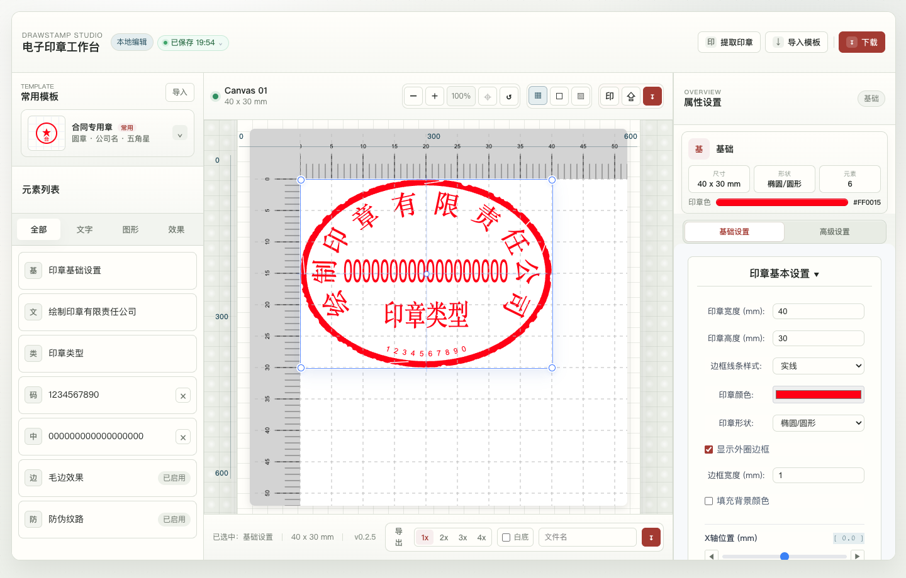

# DrawStamp Studio - Online Stamp Maker and Seal Editor

[English](README.en.md) | [简体中文](README.md)

DrawStamp Studio is a browser-local electronic stamp workspace for creating, extracting, editing, and exporting digital seal images. Core image processing stays in your browser and does not require a backend.

[](https://wosp.cc.cd/)
[](https://wosp.cc.cd/)
[](CHANGELOG.md)
[](https://vuejs.org/)
[](https://vitejs.dev/)
[](LICENSE)

## Links

| Destination | URL |
| --- | --- |
| Live app | [https://wosp.cc.cd/](https://wosp.cc.cd/) |
| GitHub repository | [fisher0627/DrawStamp_Studio](https://github.com/fisher0627/DrawStamp_Studio) |
| Bug reports and requests | [GitHub Issues](https://github.com/fisher0627/DrawStamp_Studio/issues) |

## What it does

DrawStamp Studio combines a template library, a canvas editor, browser-local image extraction, automatic local drafts, JSON template import/export, and PNG / SVG / JPEG downloads in one web interface.

Version `0.6.1` adds Chinese and English interface support, localized SEO metadata, and updated GitHub project presentation while keeping all image processing in the browser.

It is useful when you need to:

- Create round or oval stamp images for learning, testing, design previews, or legally authorized work.
- Extract a red stamp mark from a scan or photo into a transparent PNG.
- Edit company text, stamp types, codes, center text, stars, inner rings, images, SVG graphics, lines, and visual effects.
- Keep source images and draft configurations on your own device.
- Export transparent PNG, white-background PNG, SVG, or JPEG files at adjustable sizes.

## Safety and acceptable use

This project is intended for learning, testing, design previews, and legally authorized use. Do not use it to forge contracts, official documents, invoices, identity materials, or any other legal record.

You are responsible for confirming that your use complies with the laws and authorization requirements that apply to you.

## Features

- Common stamp templates for contract, company, finance, invoice, receipt, business, and quotation layouts.
- Canvas zoom, fit-to-window, reset, grid, paper, and transparency backgrounds.
- Focused property panels for each selected stamp element.
- Browser-local extraction of red stamp marks from PNG, JPG, and scanned images.
- Local automatic drafts with recent-version recovery.
- JSON template import and export.
- PNG, SVG, and JPEG export with scale, dimensions, background, and filename controls.
- Chinese and English UI with browser-language detection, manual switching, and saved preference.
- Localized titles, descriptions, Open Graph, Twitter Card, HTML language, and JSON-LD metadata.
- Cloudflare Pages SPA fallback, sitemap, robots.txt, PWA icons, and security headers.

## Technology

- Vue 3
- Vite
- TypeScript
- Canvas API
- Vue Router
- Vue I18n

## Quick start

Install dependencies:

```bash
npm install
```

Start the development server:

```bash
npm run dev
```

Open `http://127.0.0.1:5173/`.

Build for production:

```bash
npm run build
```

Preview the production build:

```bash
npm run preview
```

## Cloudflare Pages

Recommended settings:

| Setting | Value |
| --- | --- |
| Framework preset | Vue or None |
| Production branch | `main` |
| Build command | `npm run build` |
| Build output directory | `dist` |
| Root directory | Empty or `/` |

The repository includes:

- `public/_redirects` for SPA route fallback.
- `public/_headers` for baseline security headers.
- `public/robots.txt` and `public/sitemap.xml` for crawl discovery.
- Localized runtime metadata and structured data for the main routes.

## Project structure

```text
.
├── public/                         # Static assets and deployment files
├── src/
│   ├── components/editor/             # Main editor workspace and panels
│   ├── i18n/                          # Interface and legal-page translations
│   ├── stores/                        # Stamp and user state
│   ├── utils/                         # Drawing, extraction, font, and export helpers
│   ├── DrawStampUtils.ts              # Canvas drawing core
│   └── main.ts                        # Application entry
├── README.md                       # Chinese documentation
├── README.en.md                    # English documentation
└── package.json
```

## Main modules

- `src/components/editor/StampWorkspace.vue`: three-column workspace, templates, canvas controls, drafts, and export flows.
- `src/components/editor/PropertiesPanel.vue`: focused settings for the currently selected element.
- `src/components/editor/StampExtractor.vue`: local red-stamp image extraction.
- `src/DrawStampUtils.ts` and `src/utils/Draw*.ts`: stamp rendering and export logic.
- `src/i18n/`: Chinese and English interface content.
- `src/seo.ts`: localized metadata and structured-data synchronization.

## Screenshots

### Workspace


### Image extraction


### Export panel


### Canvas details



## FAQ

### Does the project require a backend?

No. The current core workflows run in the browser. Cloudflare Pages hosts the static site.

### Are uploaded source images sent to a server?

No. Image extraction runs locally in the browser. DrawStamp Studio does not configure a backend upload endpoint for the core editor workflow.

### Why can fonts look different on another computer?

Browsers can only use bundled fonts or fonts installed on the current operating system. The project bundles `STLiti`; other font availability depends on the device.

### How do I contribute or report a bug?

Open a [GitHub Issue](https://github.com/fisher0627/DrawStamp_Studio/issues) with your browser, steps to reproduce, and a non-sensitive screenshot when possible. See [CONTRIBUTING.md](CONTRIBUTING.md) for development guidance.

## License

Apache-2.0. See [LICENSE](LICENSE).
