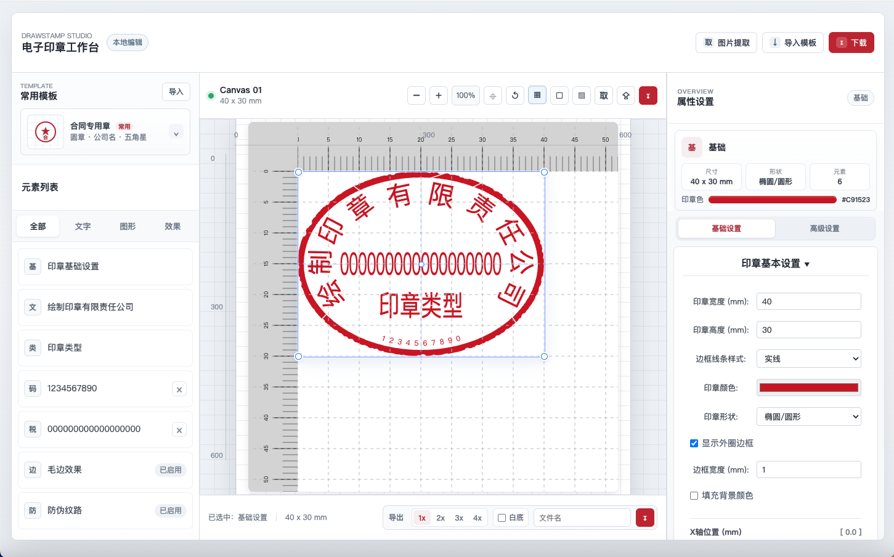
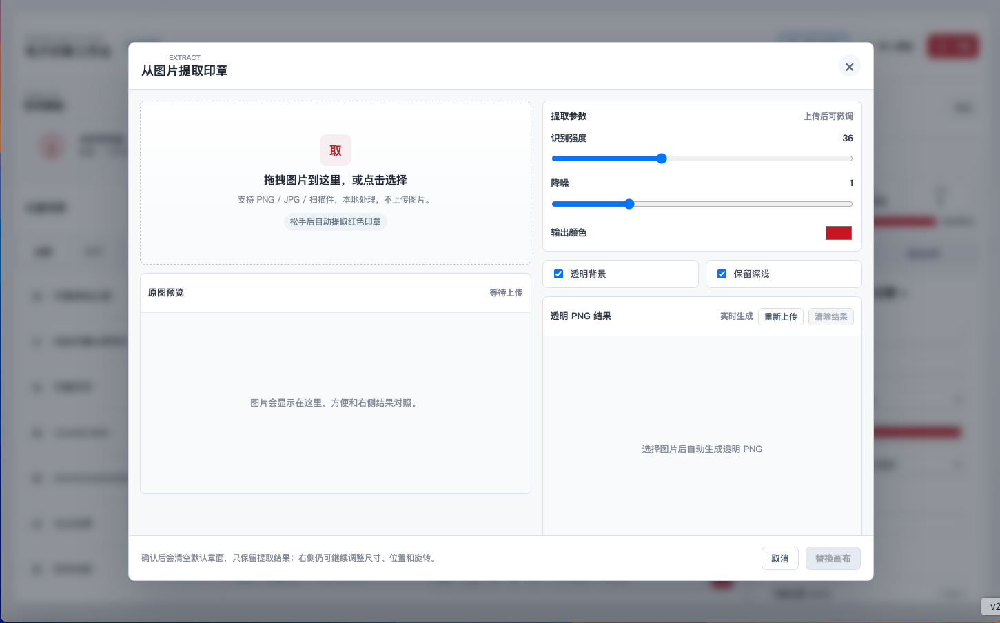
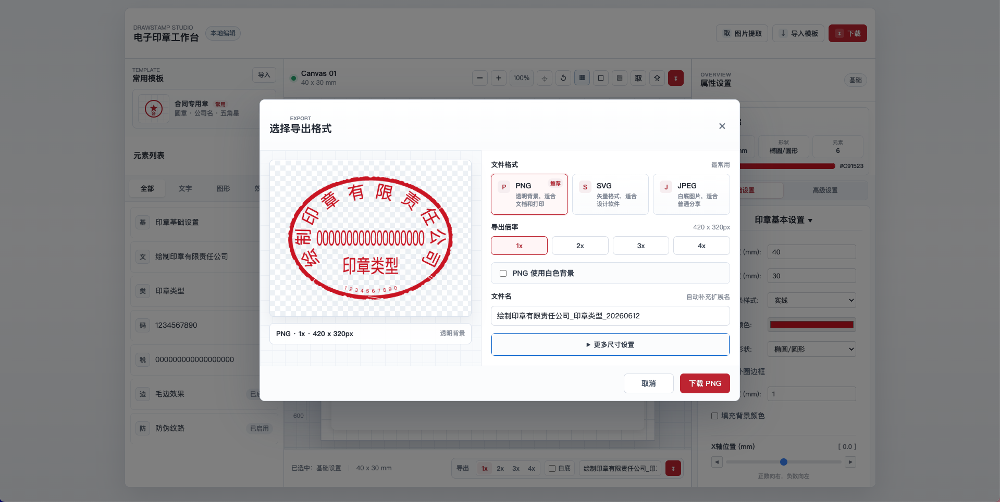

# DrawStamp Studio

在线电子印章生成器，一个基于 Vue 3 + Vite 的前端印章生成与编辑工具。

[](https://wosp.cc.cd/)
[](https://github.com/fisher0627/drawstamputils/actions)
[](https://vuejs.org/)
[](https://vitejs.dev/)
[](LICENSE)

当前项目已经从单纯的印章绘制工具，整理成一个可以直接使用的在线编辑器：支持常用模板、画布编辑、字体选择、图片提取印章、本地自动草稿、模板导入导出，以及 PNG / SVG / JPEG 多格式下载。所有核心处理都在浏览器本地完成，不依赖后端接口。

在线访问：[https://wosp.cc.cd/](https://wosp.cc.cd/)

GitHub 仓库：[https://github.com/fisher0627/drawstamputils](https://github.com/fisher0627/drawstamputils)

相关文档：

- [贡献指南](CONTRIBUTING.md)
- [版本记录](CHANGELOG.md)
- [问题反馈](https://github.com/fisher0627/drawstamputils/issues)

## 项目定位

DrawStamp Studio 更适合这些场景：

- 需要快速生成圆章、椭圆章、合同专用章、财务专用章或发票专用章图片。
- 需要把扫描件或照片里的红色印章提取为透明 PNG。
- 需要在浏览器里完成印章排版、预览、导出，不想安装桌面软件。
- 需要本地处理图片，避免把公司名称、票据截图、合同截图上传到第三方服务器。

关键词：电子印章、在线印章、印章生成器、电子印章生成器、图片提取印章、透明 PNG 印章、stamp generator、digital seal。

## 安全说明

本项目仅用于学习、测试和合规场景下的电子印章图片制作。请勿将本项目生成或处理的图片用于任何违法、欺诈、伪造公文、伪造合同、伪造票据等用途。

使用者应自行确认使用场景符合当地法律法规。因不当使用造成的法律责任和损失，由使用者自行承担。

## 功能特点

- 常用印章模板：支持合同、公章、财务、发票、收讫、业务、报价和空白基础章，并提供分类筛选。
- 专业画布编辑：缩放、适配窗口、重置视图、网格背景、纸张背景、透明棋盘格背景。
- 元素列表管理：公司名称、印章类型、编码、税号、五角星、内圈、图片、线条、SVG 等元素集中管理。
- 属性面板：基础设置与高级设置分区，按当前选中元素显示对应参数。
- 字体选择：内置常用中文字体选项，并支持本地打包的华文隶书字体。
- 图片提取印章：支持拖拽上传图片，本地提取红色印章区域，生成透明 PNG，并可直接替换到画布。
- 模板导入导出：可将当前印章配置保存为 JSON，也可以重新导入继续编辑。
- 本地自动草稿：编辑状态会保存在当前浏览器，并保留最近 5 个草稿版本，刷新页面后可以继续处理。
- 导出面板：支持 PNG / SVG / JPEG、多倍导出、白底 PNG、文件名设置、导出预览和高级尺寸设置。
- 本地优先：印章生成、图片提取、导出都在浏览器端完成。

## 技术栈

- Vue 3
- Vite
- TypeScript
- Canvas
- Vue Router
- Vue I18n

## 快速开始

### 安装依赖

```bash
npm install
```

### 本地开发

```bash
npm run dev
```

默认访问地址：

```text
http://127.0.0.1:5173/
```

### 生产构建

```bash
npm run build
```

构建结果会输出到 `dist` 目录。

### 本地预览构建结果

```bash
npm run preview
```

## Cloudflare Pages 部署

本项目已经适配 Cloudflare Pages，推荐使用 GitHub 仓库自动部署。

Cloudflare Pages 构建配置：

| 配置项 | 值 |
| --- | --- |
| Framework preset | Vue 或 None |
| Production branch | `main` |
| Build command | `npm run build` |
| Build output directory | `dist` |
| Root directory | 留空或 `/` |

提交代码到 GitHub 后，Cloudflare Pages 会自动拉取仓库并重新部署。

## 项目结构

```text
.
├── public/                         # README 展示图与静态资源
├── src/
│   ├── assets/                     # 字体、图标等资源
│   ├── components/
│   │   └── editor/                 # 当前主要编辑器组件
│   ├── stores/                     # 印章配置状态
│   ├── utils/                      # 绘制、提取、字体等工具函数
│   ├── DrawStampUtils.ts           # 印章绘制核心
│   ├── EditorControls.vue          # 编辑器控制入口
│   └── main.ts                     # 应用入口
├── vite.config.ts                  # Vite 与构建配置
├── package.json
└── README.md
```

## 主要模块

### 印章工作台

核心界面位于：

```text
src/components/editor/StampWorkspace.vue
```

它负责编辑器三栏布局、画布工具栏、模板入口、导入导出、当前选中元素联动等逻辑。

### 属性设置

属性面板位于：

```text
src/components/editor/PropertiesPanel.vue
src/components/editor/panels/
```

不同类型的印章元素拥有各自的设置面板，例如公司名称、印章编码、税号、内圈、图片、SVG、线条、毛边、做旧等。

### 图片提取印章

图片提取弹窗与处理逻辑位于：

```text
src/components/editor/StampExtractor.vue
src/utils/extractStampImage.ts
```

该功能支持拖拽上传，自动提取红色印章区域，并输出透明背景图片。

### 绘制核心

印章绘制核心位于：

```text
src/DrawStampUtils.ts
src/utils/Draw*.ts
```

画布中的边框、公司名称、印章类型、编码、税号、内圈、五角星、图片、SVG、防伪纹路、毛边和做旧效果都通过这些模块绘制。

## 使用建议

1. 先从左侧常用模板选择接近需求的印章类型。
2. 在左侧元素列表选择要编辑的对象。
3. 在右侧属性设置中调整文字、字体、位置、尺寸、颜色等参数。
4. 使用画布工具栏缩放或适配窗口，检查印章边界和排版。
5. 通过底部导出区域或下载弹窗选择格式、倍数、背景和文件名，再下载 PNG / SVG / JPEG。

## 截图

### 印章工作台



### 图片提取印章



### 导出面板



## 常见问题

### 这个项目需要后端吗？

不需要。当前核心功能都在浏览器端完成，Cloudflare Pages 只负责托管静态文件。

### 图片提取会上传到服务器吗？

不会。图片提取逻辑在浏览器本地执行，不会主动上传图片。

### 为什么某些字体在不同电脑上显示不同？

浏览器只能稳定使用系统已安装字体或项目内置字体。项目已经内置华文隶书字体，但其他系统字体仍可能受当前设备影响。

### Cloudflare Pages 构建失败怎么办？

优先确认构建配置是否为：

```text
Build command: npm run build
Build output directory: dist
```

如果遇到 Rollup optional dependencies 相关错误，可以重新生成 lockfile：

```bash
npm install --package-lock-only --include=optional
```

然后提交更新后的 `package-lock.json`。

## 开发命令

```bash
npm run dev       # 启动本地开发服务
npm run build     # 构建生产版本
npm run preview   # 本地预览生产构建
```

## 许可证

本项目基于 Apache-2.0 License。
