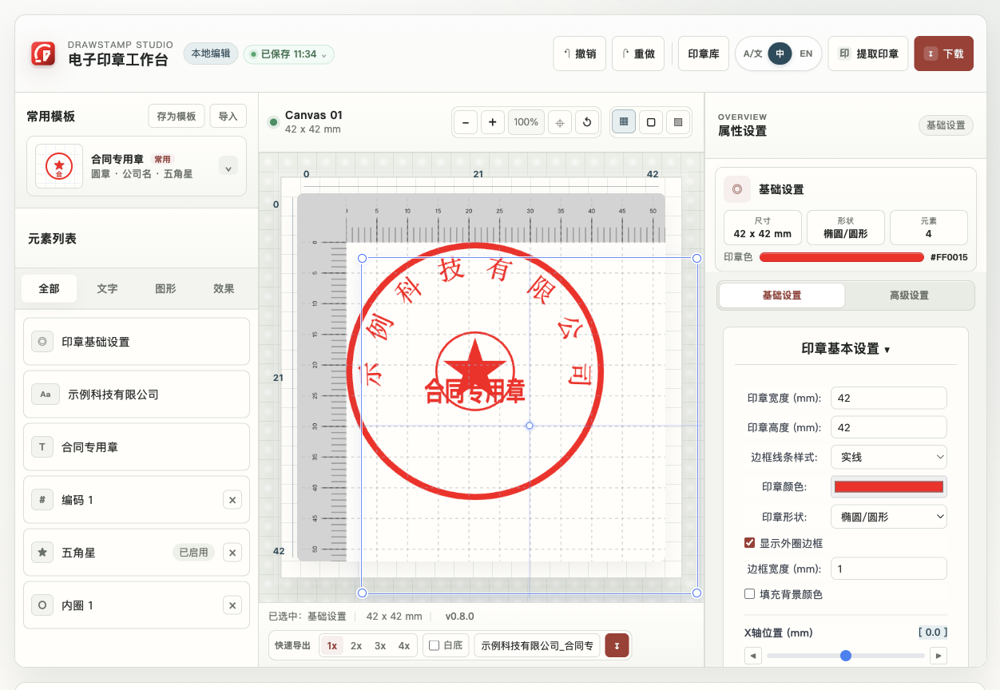
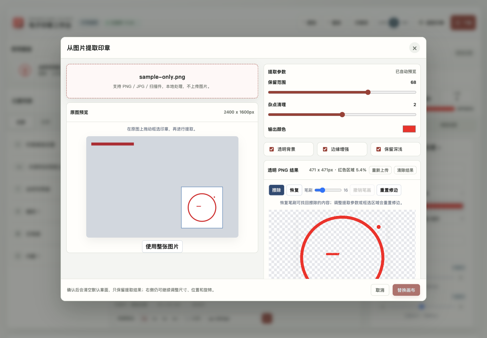
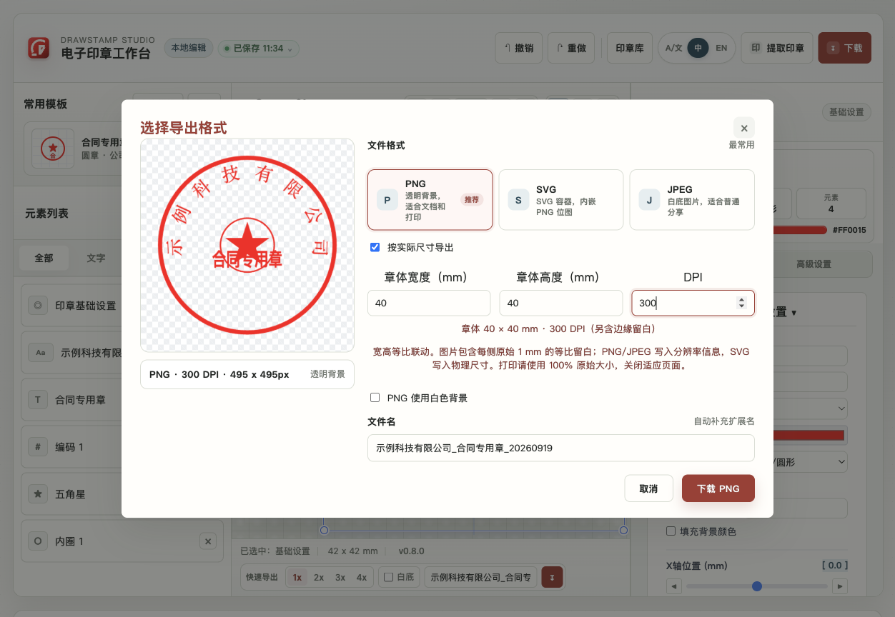
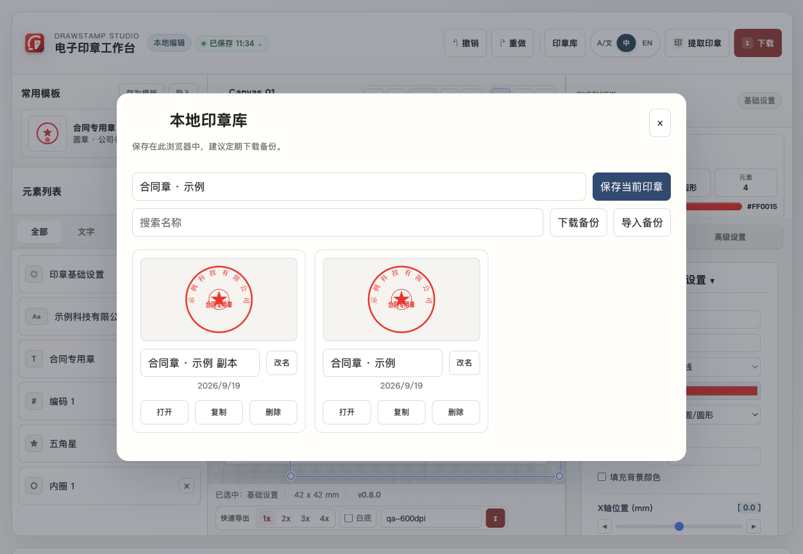
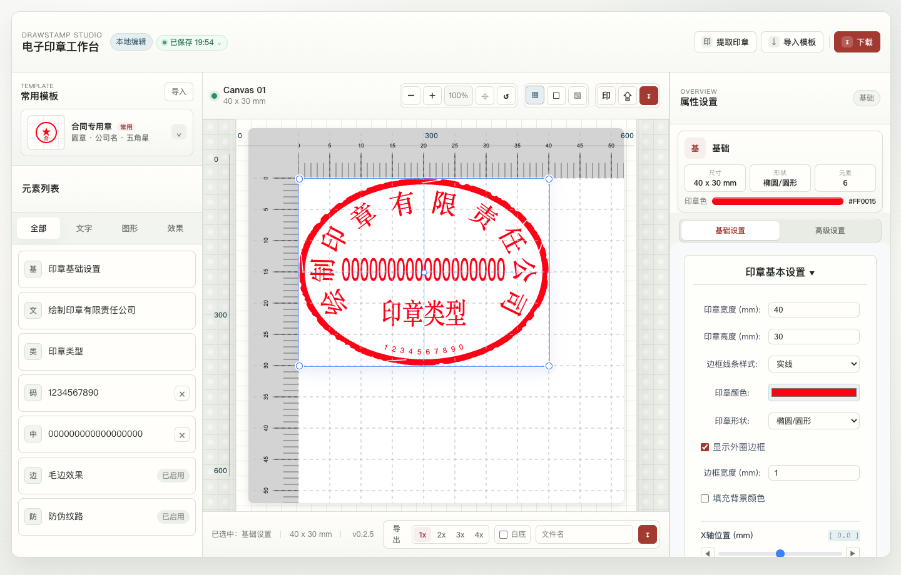

# DrawStamp Studio - 在线电子印章工作台

[简体中文](README.md) | [English](README.en.md)

一个可以直接在线使用的电子印章工作台，支持印章生成、图片提取、画布编辑、模板管理和多格式导出。核心处理都在浏览器本地完成，不依赖后端接口。

A browser-local electronic stamp editor for generating, extracting, editing and exporting digital seals.

[](https://wosp.cc.cd/)
[](https://wosp.cc.cd/)
[](CHANGELOG.md)
[](https://vuejs.org/)
[](https://vitejs.dev/)
[](LICENSE)

## 官方入口

| 入口 | 地址 |
| --- | --- |
| 在线使用 | [https://wosp.cc.cd/](https://wosp.cc.cd/) |
| GitHub 仓库 | [https://github.com/fisher0627/DrawStamp_Studio](https://github.com/fisher0627/DrawStamp_Studio) |
| 问题反馈 | [GitHub Issues](https://github.com/fisher0627/DrawStamp_Studio/issues) |

## 项目说明

DrawStamp Studio 已经从单纯的印章绘制工具，整理成一个完整的在线编辑器：支持常用模板、纸感专业画布、字体选择、图片提取印章、本地自动草稿、模板导入导出，以及 PNG / SVG / JPEG 多格式下载。

当前版本 `0.8.0` 新增完整撤销／重做、提取框选与修边、按毫米和 DPI 导出，以及可备份的本地印章库。所有核心操作仍在浏览器本地完成。

相关文档：

- [贡献指南](CONTRIBUTING.md)
- [版本记录](CHANGELOG.md)
- [关于项目](https://wosp.cc.cd/about)
- [隐私政策](https://wosp.cc.cd/privacy)
- [服务条款](https://wosp.cc.cd/terms)
- [联系反馈](https://wosp.cc.cd/contact)

## 实用指南

- [从图片提取透明印章](https://wosp.cc.cd/extract-transparent-stamp)：在浏览器本地清理背景、检查边缘，并导出透明 PNG、SVG 或 JPEG。
- [圆形印章模板](https://wosp.cc.cd/round-company-seal-template)：从基础圆形或椭圆形样式调整文字、边框、五角星与布局。
- [SVG 印章导出](https://wosp.cc.cd/svg-stamp-export)：了解 SVG、PNG、JPEG 的适用场景，并了解当前 SVG 内嵌 PNG 位图的限制。

以上说明仅适用于学习、设计预览和已获授权的使用场景；工具不会核验印章、文件或授权关系。

## 项目定位

DrawStamp Studio 更适合这些场景：

- 需要快速生成圆章、椭圆章、合同专用章、财务专用章或发票专用章图片。
- 需要把扫描件或照片里的红色印章提取为透明 PNG。
- 需要在浏览器里完成印章排版、预览、导出，不想安装桌面软件。
- 需要本地处理图片，避免把公司名称、票据截图、合同截图上传到第三方服务器。

关键词：电子印章、在线印章、印章生成器、电子印章生成器、图片提取印章、透明 PNG 印章、stamp generator、digital seal。

## 安全说明

本项目仅用于学习、测试和合规场景下的电子印章图片制作。请勿将本项目生成或处理的图片用于任何违法、欺诈、伪造公文、伪造合同、伪造票据等用途。

使用者应自行确认使用场景符合当地法律法规。因不当使用造成的法律责任和损失，由使用者自行承担。

## 功能特点

- 常用印章模板：支持合同、公章、财务、发票、收讫、业务、报价和空白基础章，并提供分类筛选。
- 完整撤销与重做：覆盖文字、参数、元素删除、模板切换和提取替换；支持 ⌘/Ctrl Z 与 ⌘/Ctrl Shift Z，连续拖动合并为一步。
- 本地印章库：使用 IndexedDB 保存命名作品和缩略图，支持搜索、改名、复制、删除恢复与 JSON 备份导入导出。
- 专业画布编辑：缩放、适配窗口、重置视图、网格背景、纸张背景、透明棋盘格背景。
- 克制编辑器界面：纸感工作台、标尺网格、蓝色选框、分组工具栏和清晰的底部导出区域。
- 元素列表管理：公司名称、印章类型、编码、税号、五角星、内圈、图片、线条、SVG 等元素集中管理。
- 属性面板：基础设置与高级设置分区，按当前选中元素显示对应参数。
- 字体选择：内置常用中文字体选项，并支持本地打包的华文隶书字体。
- 图片提取印章：支持拖拽上传、原图框选后提取、擦除／恢复笔刷和笔画撤销；恢复笔刷找回已擦除的像素，重新提取会重置修边。
- 模板导入导出：可将当前印章配置保存为 JSON，也可以重新导入继续编辑。
- 本地自动草稿：编辑状态会保存在当前浏览器，并保留最近 5 个草稿版本，刷新页面后可以继续处理。
- 导出面板：支持 PNG / SVG / JPEG、多倍导出、白底 PNG、文件名设置、独立画布预览和毫米＋DPI 导出；PNG/JPEG 写入分辨率信息，SVG 写入物理尺寸。
- 本地优先：印章生成、图片提取、导出都在浏览器端完成。
- 中英文界面：根据浏览器语言自动选择中文或英文，也可在页面中手动切换并记住选择。
- 公开说明页：提供关于项目、隐私政策、服务条款和联系反馈页面，方便 GitHub 与搜索引擎展示。
- SEO 与部署适配：中英文标题、页面描述、Open Graph、Twitter Card 和 JSON-LD 会随界面语言同步，并内置 sitemap、robots 与 Cloudflare Pages SPA 回退。

## 技术栈

- Vue 3
- Vite
- TypeScript
- Canvas
- Vue Router
- Vue I18n

## 快速开始

### 安装依赖

```bash
npm install
```

### 本地开发

```bash
npm run dev
```

默认访问地址：

```text
http://127.0.0.1:5173/
```

### 生产构建

```bash
npm run build
```

构建结果会输出到 `dist` 目录。

### 本地预览构建结果

```bash
npm run preview
```

## Cloudflare Pages 部署

本项目已经适配 Cloudflare Pages，推荐使用 GitHub 仓库自动部署。

Cloudflare Pages 构建配置：

| 配置项 | 值 |
| --- | --- |
| Framework preset | Vue 或 None |
| Production branch | `main` |
| Build command | `npm run build` |
| Build output directory | `dist` |
| Root directory | 留空或 `/` |

提交代码到 GitHub 后，Cloudflare Pages 会自动拉取仓库并重新部署。

当前静态 SEO 与部署相关文件：

- `index.html`：站点 meta、Open Graph、Twitter Card 与 SoftwareApplication 结构化数据。
- `src/seo-pages.json`：中英文页面元数据与 16 个公开 URL 的配置来源。
- `scripts/prerender-seo.mjs`：构建时生成预渲染页面与 `dist/sitemap.xml`，包括首页、说明页和 3 篇中英文实用指南。
- `public/robots.txt`：允许抓取并声明 sitemap。
- `public/_redirects`：Cloudflare Pages SPA 路由回退。
- `public/_headers`：基础安全响应头。

大版本或明显界面变动时，需要同步更新 `README.md`、`README.en.md`、`CHANGELOG.md`、`package.json`、`package-lock.json`、README 截图、`public/social-preview.png`、SEO 页面配置、`public/_headers` 和 `public/_redirects`，确保 GitHub 仓库首页与线上版本保持一致。

## 项目结构

```text
.
├── public/                         # README 展示图与静态资源
├── src/
│   ├── assets/                     # 字体、图标等资源
│   ├── components/
│   │   └── editor/                 # 当前主要编辑器组件
│   ├── stores/                     # 印章配置状态
│   ├── utils/                      # 绘制、提取、字体等工具函数
│   ├── DrawStampUtils.ts           # 印章绘制核心
│   ├── EditorControls.vue          # 编辑器控制入口
│   └── main.ts                     # 应用入口
├── vite.config.ts                  # Vite 与构建配置
├── package.json
└── README.md
```

## 主要模块

### 印章工作台

核心界面位于：

```text
src/components/editor/StampWorkspace.vue
```

它负责编辑器三栏布局、画布工具栏、模板入口、导入导出、当前选中元素联动等逻辑。

### 属性设置

属性面板位于：

```text
src/components/editor/PropertiesPanel.vue
src/components/editor/panels/
```

不同类型的印章元素拥有各自的设置面板，例如公司名称、印章编码、税号、内圈、图片、SVG、线条、毛边、做旧等。

### 图片提取印章

图片提取弹窗与处理逻辑位于：

```text
src/components/editor/StampExtractor.vue
src/utils/extractStampImage.ts
```

该功能支持拖拽上传，自动提取红色印章区域，并输出透明背景图片。

### 绘制核心

印章绘制核心位于：

```text
src/DrawStampUtils.ts
src/utils/Draw*.ts
```

画布中的边框、公司名称、印章类型、编码、税号、内圈、五角星、图片、SVG、防伪纹路、毛边和做旧效果都通过这些模块绘制。

## 使用建议

1. 先从左侧常用模板选择接近需求的印章类型。
2. 在左侧元素列表选择要编辑的对象。
3. 在右侧属性设置中调整文字、字体、位置、尺寸、颜色等参数。
4. 使用画布工具栏缩放或适配窗口，检查印章边界和排版。
5. 通过底部导出区域或下载弹窗选择格式、倍数、背景和文件名，再下载 PNG / SVG / JPEG。

## 截图

### 印章工作台



### 图片提取印章



### 导出面板



### 本地印章库



### 画布细节



## 使用示例

- 合同章、公章、财务章、发票章等常用模板可以直接从左侧模板库开始。
- 圆章、椭圆章、编码、中间文字、内圈、五角星、毛边、防伪纹路都可以按需启用和调整。
- 扫描件或截图中的红色印章可以在图片提取弹窗里本地处理，再替换到画布继续编辑。
- 导出时可以选择 PNG / SVG / JPEG、透明或白底、1x 到 4x 倍率和自定义文件名。

## 常见问题

### 这个项目需要后端吗？

不需要。当前核心功能都在浏览器端完成，Cloudflare Pages 只负责托管静态文件。

### 图片提取会上传到服务器吗？

不会。图片提取逻辑在浏览器本地执行，不会主动上传图片。

### 按实际尺寸导出时如何打印？

导出面板启用“按实际尺寸导出”，输入章体毫米尺寸及 72–1200 的整数 DPI。宽高保持等比；图片另含原始每侧 1 mm 的等比留白，像素尺寸按整数取整。打印选择 100% 原始大小，关闭“适应页面”。不同文档软件可能忽略分辨率元数据，插入后应复核物理尺寸。

### SVG 是真正的矢量图吗？

当前导出是内嵌 PNG 位图的 SVG 容器，放大仍会失真，文字不能作为独立矢量元素编辑。继续编辑请保存 JSON 模板或存入本地印章库。

### 本地印章库会跨设备同步吗？

不会。作品保存在当前浏览器和站点地址下；清除站点数据可能删除作品。可下载 JSON 备份，并在另一设备导入。导入备份会新增作品，不覆盖现有作品。

### 为什么某些字体在不同电脑上显示不同？

浏览器只能稳定使用系统已安装字体或项目内置字体。项目已经内置华文隶书字体，但其他系统字体仍可能受当前设备影响。

### Cloudflare Pages 构建失败怎么办？

优先确认构建配置是否为：

```text
Build command: npm run build
Build output directory: dist
```

如果遇到 Rollup optional dependencies 相关错误，可以重新生成 lockfile：

```bash
npm install --package-lock-only --include=optional
```

然后提交更新后的 `package-lock.json`。

## 开发命令

```bash
npm run dev       # 启动本地开发服务
npm run build     # 构建生产版本
npm run preview   # 本地预览生产构建
npm test          # PNG/JPEG 分辨率元数据回归检查
```

## 许可证

本项目基于 Apache-2.0 License。
